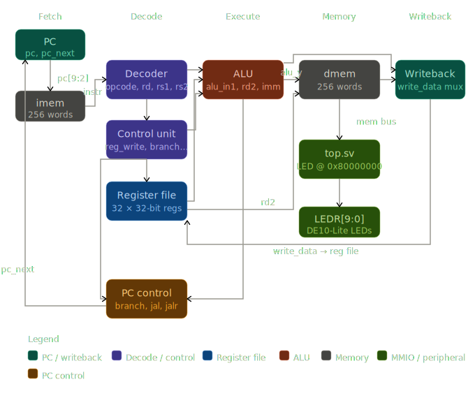
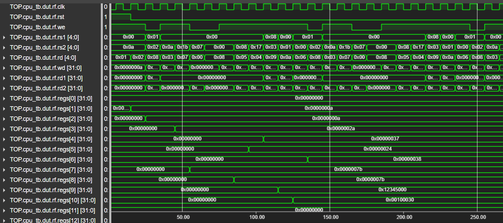
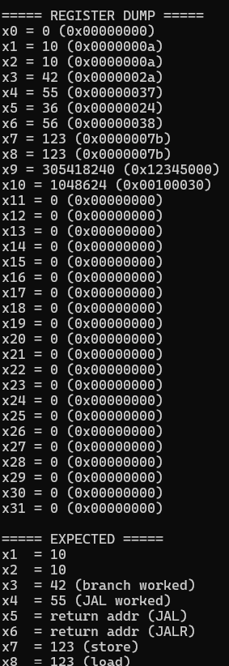

# RISC-V CPU

A 32-bit RISC-V (RV32I) CPU implemented in SystemVerilog, simulated with Verilator and deployed on a DE10-Lite FPGA.

## Overview

This project implements a single-cycle RISC-V CPU from scratch. The CPU executes programs compiled from C using the RISC-V GCC toolchain and interacts with hardware peripherals via memory-mapped I/O (MMIO).

<p align="center">
  
</p>

## Architecture

### CPU Pipeline
Single-cycle execution — one instruction completes per clock cycle:
- **Fetch** — reads instruction from `imem` using the program counter
- **Decode** — extracts opcode, register indices, and immediate from the instruction
- **Execute** — ALU computes result or memory address
- **Memory** — reads or writes `dmem` for load/store instructions
- **Writeback** — writes result back to the register file

### Modules
| Module | Description |
|---|---|
| `cpu.sv` | Top-level CPU, connects all submodules |
| `decoder.sv` | Decodes instruction fields and generates immediates |
| `control_unit.sv` | Generates control signals from opcode/funct fields |
| `alu.sv` | Arithmetic and logic unit |
| `register.sv` | 32-entry register file |
| `top.sv` | FPGA top level, wires CPU to board peripherals |
| `CPU_DEFS.sv` | Shared package of ALU control constants |

### Memory Map
| Address Range | Description |
|---|---|
| `0x00000000 – 0x000003FF` | Instruction memory (256 words) |
| `0x00000000 – 0x000003FF` | Data memory (256 words) |
| `0x80000000` | LED peripheral register (MMIO) |

> Note: `imem` and `dmem` are separate arrays inside the CPU — they occupy the same address range but are accessed by different control signals (instruction fetch vs load/store).

### MMIO
Peripheral registers are memory-mapped — the CPU writes to them using normal `sw` instructions. `top.sv` monitors the memory bus and latches writes to known addresses:

| Address | Peripheral |
|---|---|
| `0x80000000` | LED register (`LEDR[9:0]`) |

### dmem Write Guard
The write guard `alu_y[31:10] == 22'b0` ensures stores only affect `dmem` for addresses below `0x400`. Stores to `0x80000000` (LEDs) pass through the guard unmatched and are caught by `top.sv` instead.

## Project Structure
```
RISCV-CPU/
├── rtl/           SystemVerilog source files
├── sw/            C toolchain — main.c, start.s, link.ld, Makefile, program.hex
├── tb/            Verilator testbenches
└── docs           Useful docs
```

## Build and Deploy

### Simulate 
```bash
verilator --binary --trace -sv rtl/*.sv tb/cpu_tb.sv --top-module cpu_tb
./obj_dir/Vcpu_tb
gtkwave sim/tb_top.vcd
```

<p align="center">
  
</p>

### Compile C Program
```bash
cd sw
make clean
make
```
Produces `program.hex` which is loaded into `imem` via `$readmemh` at Quartus synthesis time.

### Deploy to FPGA
1. `git pull` in the Quartus project folder on Windows
2. Open Quartus and run **Processing → Start Compilation**
3. Open **Tools → Programmer**, select the `.sof` from `output_files/`
4. Click **Start** to flash the DE10-Lite
   
<p align="center">
  
</p>

## Hardware
- **Board:** Terasic DE10-Lite
- **FPGA:** Intel MAX 10 (10M50DAF484C7G)
- **Clock:** 50 MHz (MAX10_CLK1_50)
- **Reset:** KEY[0] (active-low)
- **Output:** LEDR[9:0] — bottom 8 bits driven by LED MMIO register
- **7-Segment:** HEX0–HEX5 tied off (active-low, all segments off)

## Toolchain
- **Simulator:** Verilator
- **Synthesis:** Intel Quartus Prime Lite
- **Compiler:** riscv64-unknown-elf-gcc (GCC 13.2, rv32i, ilp32)
  
<p align="center">
  
</p>

## Writing Programs
Programs are written in C and compiled to a flat hex file. `start.s` sets up the stack pointer and calls `main()`. `link.ld` places code at `0x0` and data at `0x400`.

```c
#define LED_REG (*(volatile unsigned int *)0x80000000)

int main() {
    LED_REG = 0xFF;   // light up all 8 LEDs
    while(1);
}
```
```bash
cd sw && make
```
The hex is baked into the FPGA bitstream at Quartus compile time — no file system exists on the FPGA at runtime.
